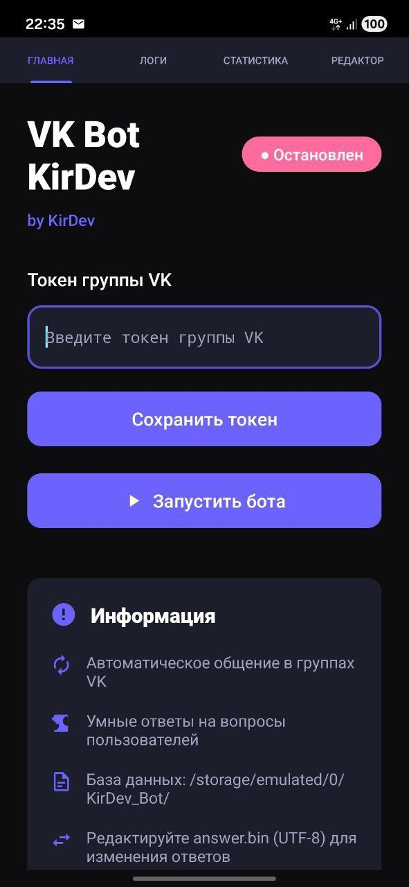
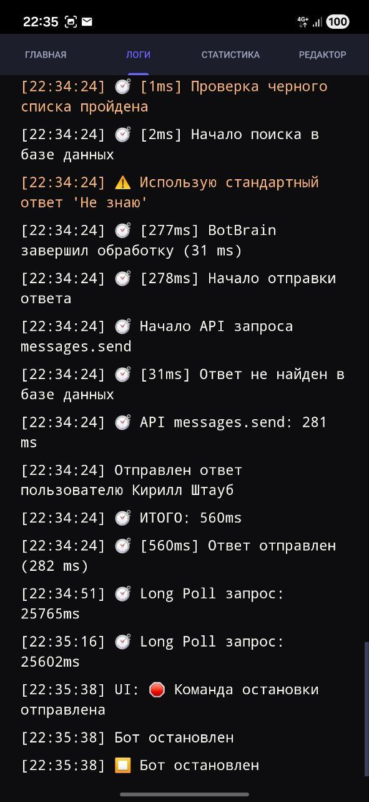
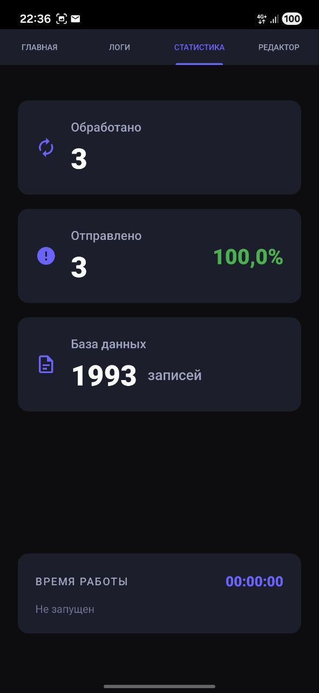
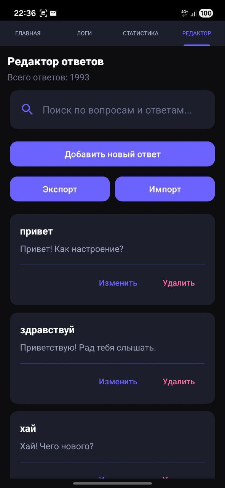
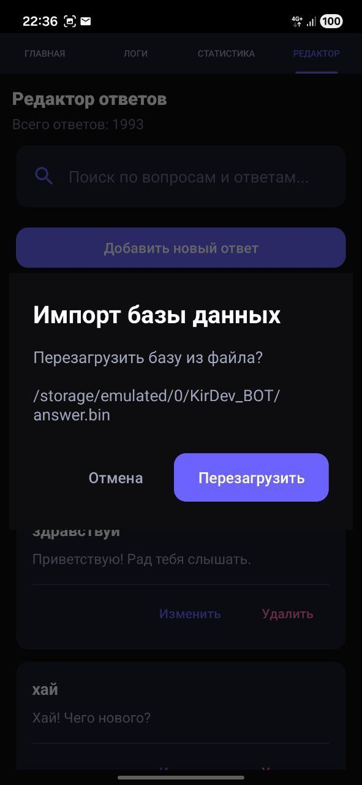
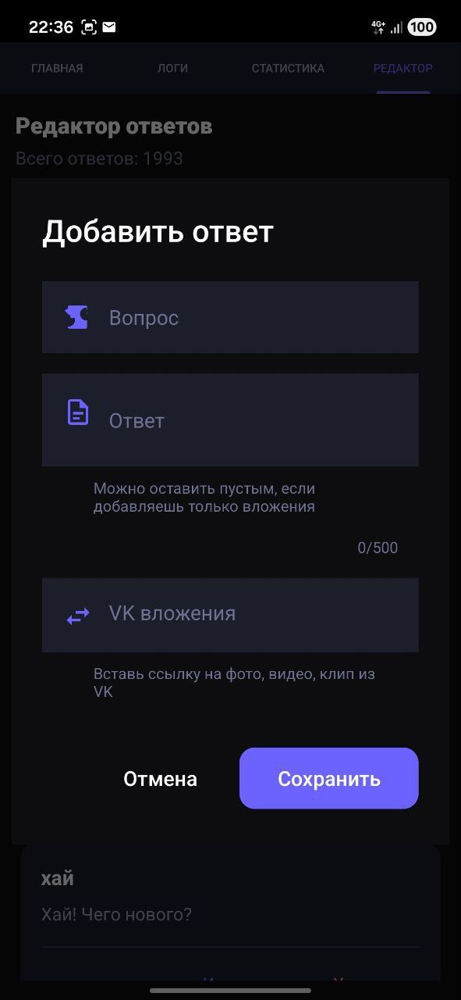

# VK Bot KirDev 🤖
*Автономный чат-бот для сообществ ВКонтакте, работающий прямо на Android устройстве. Позволяет управлять ответами и статистикой без написания кода.*

Главный экран


Лог


Статистика


Редактор


Импорт базы


Добавить ответ


## 🚀 Основные возможности

* **Локальная база знаний:** Все вопросы и ответы хранятся в файловой базе данных с индексацией. Поддержка текстовых ответов и вложений (фото, видео, документы).

* **Встроенный редактор:** Удобный интерфейс для добавления новых реакций (Вопрос → Ответ → Вложения) прямо в приложении. Поиск по базе данных в реальном времени.

* **Фоновая работа:** Реализована система "Sticky Service" с защитой от убийства процесса системой (актуально для Samsung/Xiaomi). Бот работает даже при закрытом приложении.

* **Живая статистика:** Отслеживание времени работы (Uptime), количества обработанных и отправленных сообщений в реальном времени.

* **Консоль логов:** Просмотр входящих событий и ошибок прямо на экране телефона с автопрокруткой.

* **Material Design 3:** Современный интерфейс в темной теме (Dark Purple) для комфортной работы.

## 🛠 Технический стек

* **Язык:** Java / Kotlin
* **Архитектура:** Android Native
* **База данных:** Файловая система (UTF-8) с индексацией
* **API:** VK Community API (Long Poll)
* **UI:** Material Design 3, ViewBinding, RecyclerView

## 📱 Системные требования

* **Минимальная версия:** Android 11.0 (R, API 30)
* **Рекомендуемая версия:** Android 11+ (API 30+)
* **Оптимизация:** Приложение адаптировано для работы с агрессивными энергосберегающими режимами (Samsung OneUI, MIUI).

## 📦 Установка и запуск

1. Скачайте и установите APK файл на Android устройство
2. Откройте приложение и перейдите на главный экран
3. Введите токен группы ВКонтакте в поле "Токен группы VK"
4. Нажмите "Сохранить токен"
5. Нажмите "Запустить бота"
6. (Опционально) Для Samsung: Разрешите работу в фоне в настройках батареи

### Получение токена группы VK

1. Перейдите в настройки вашей группы ВКонтакте
2. Выберите "Работа с API" → "Ключи доступа"
3. Создайте новый ключ с правами на "Управление сообществом" и "Сообщения сообщества"
4. Скопируйте токен и вставьте в приложение

## 🎨 Структура приложения

### Главный экран
- Ввод и сохранение токена группы
- Запуск/остановка бота
- Индикатор статуса работы
- Информация о приложении

### Статистика
- Время работы бота (Uptime)
- Количество обработанных сообщений
- Количество отправленных ответов
- Размер базы данных

### Редактор ответов
- Просмотр всех вопросов и ответов
- Добавление новых пар "Вопрос → Ответ"
- Редактирование существующих записей
- Удаление записей (свайп влево)
- Поиск по базе данных
- Экспорт/импорт базы данных

### Логи
- Просмотр входящих сообщений
- Отслеживание отправленных ответов
- Мониторинг ошибок и событий
- Автопрокрутка к последнему сообщению

## 🔧 Сборка проекта

### Требования для разработки
- Android Studio Hedgehog или новее
- JDK 17+ (рекомендуется JDK 21 из Android Studio)
- Gradle 8.7
- Android SDK 34

### Команды сборки

```bash
# Сборка debug версии
gradlew assembleDebug

# Сборка release версии
gradlew assembleRelease

# Установка на подключенное устройство
gradlew installDebug

# Очистка проекта
gradlew clean
```

### Скрипты для Windows

```batch
# Сборка проекта (Debug)
build_apk.bat
```

## 📁 Структура проекта

```
app/src/main/
├── java/com/vkbot/manager/
│   ├── MainActivity.kt              # Главная активность
│   ├── MainFragment.kt              # Главный экран
│   ├── StatisticsFragment.kt        # Экран статистики
│   ├── AnswersEditorFragment.kt     # Редактор ответов
│   ├── LogsFragment.kt              # Экран логов
│   ├── BotService.kt                # Фоновый сервис бота
│   ├── VKBotManager.kt              # Менеджер VK API
│   └── botbrain/
│       ├── BotBrain.java            # Логика обработки сообщений
│       ├── AnswerDatabase.java      # База данных ответов
│       ├── AndroidFileManager.java  # Работа с файлами
│       ├── MessageSimilarity.java   # Поиск похожих вопросов
│       └── VKMediaHelper.java       # Парсинг VK медиа
└── res/
    ├── layout/                      # XML разметки экранов
    ├── drawable/                    # Иконки и графика
    └── values/                      # Цвета, строки, темы
```

## 🎯 Особенности реализации

### Умный поиск ответов
- Точное совпадение вопроса
- Поиск по ключевым словам
- Алгоритм схожести текста (Levenshtein distance)
- LRU кэш для быстрого доступа
- История ответов для разнообразия

### Защита от убийства процесса
- Foreground Service с постоянным уведомлением
- Приоритет PRIORITY_MAX для Samsung
- Автоматический перезапуск при сбое
- Отслеживание закрытия уведомления

### Оптимизация производительности
- Асинхронная обработка сообщений (Coroutines)
- Индексация базы данных для быстрого поиска
- Ленивая загрузка списков (RecyclerView)
- Минимальное потребление батареи

## 📝 Формат базы данных

База данных хранится в файле `/storage/emulated/0/KirDev_BOT/answer.bin` в формате UTF-8:

```
# База ответов KirDev Bot (UTF-8)
# Формат: ВОПРОС|ОТВЕТ|ВЛОЖЕНИЯ
# Строки начинающиеся с # - комментарии

привет|Привет! Я KirDev Bot 👋
как дела|Все отлично, работаю!
фото|Держи фото!|photo123_456
видео|Вот видео для тебя!|video789_012
документ|Вот документ|doc456_789
```

### Формат вложений
- Фото: `photo{owner_id}_{media_id}_{access_key}`
- Видео: `video{owner_id}_{media_id}_{access_key}`
- Документ: `doc{owner_id}_{media_id}_{access_key}`

## 🐛 Известные проблемы

- На некоторых устройствах Samsung требуется вручную отключить оптимизацию батареи
- MIUI может убивать процесс при длительной работе (требуется автозапуск)
- Long Poll может отключаться при слабом интернет-соединении

## 📄 Лицензия

Этот проект разработан для личного использования.

---

**Developed by KirDev** 💜

*Если у вас возникли вопросы или предложения, создайте Issue в репозитории.*
